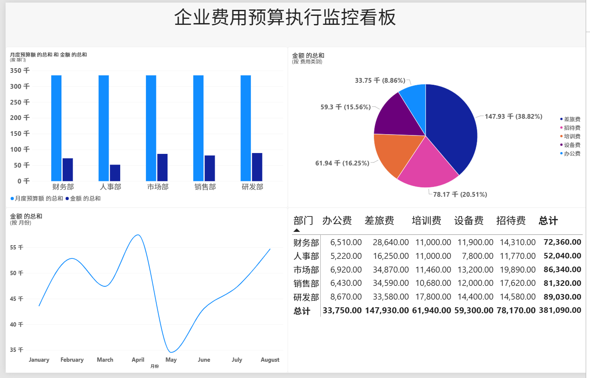
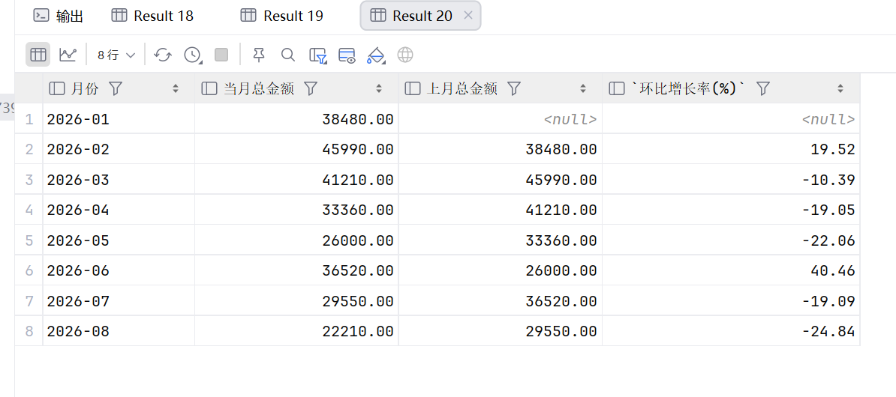
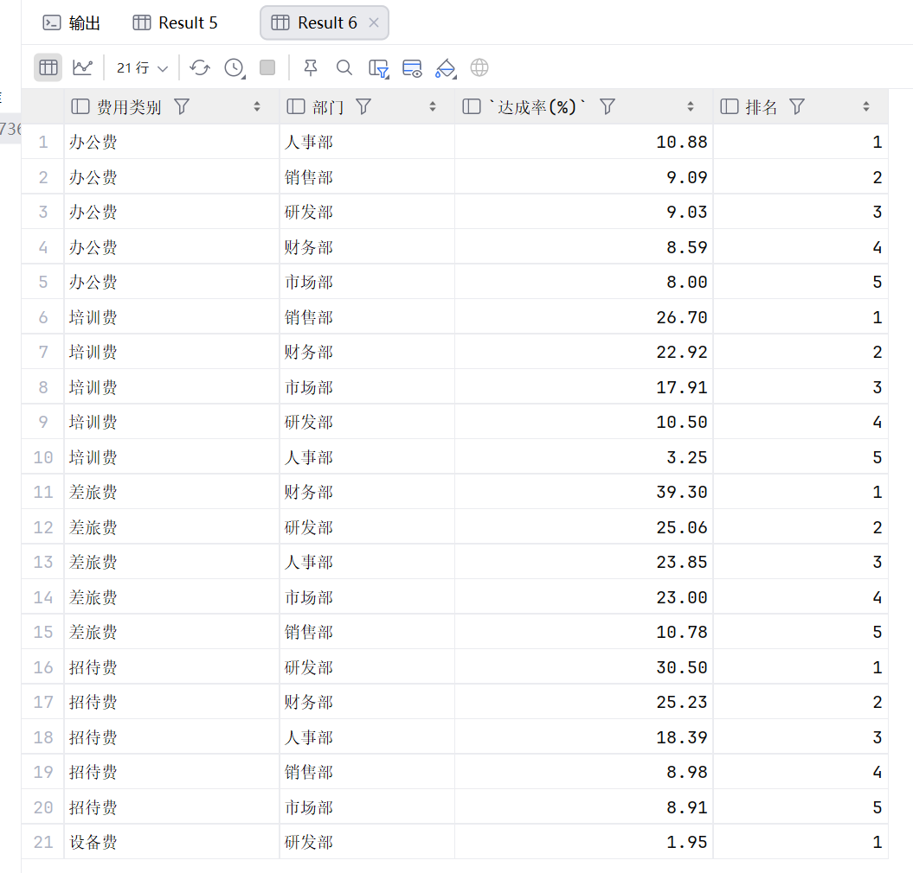

# 企业费用预算执行分析（MySQL + Power BI）

## 项目简介

本仓库是一个企业费用报销与预算执行的实战练习项目。以某企业 2026 年 1—8 月费用报销数据为样本，完成从**数据建模 → SQL 多维分析 → Power BI 可视化看板**的完整流程，重点练习预算执行监控、超支预警和趋势分析能力。

## 数据说明

项目共 3 张表，部门口径完全一致、可以通过主外键关联：

| 表名 | 说明 | 规模 |
| --- | --- | --- |
| employee_info | 人员信息表：姓名、部门、职级 | 29 人（5 个部门） |
| budget_base | 预算基准表：部门 + 费用类别 + 月度预算额 | 25 条（5 部门 × 5 类别） |
| expense_detail | 费用明细表：流水号、日期、部门、申请人、费用类别、金额、审批状态 | 180 条（2026-01 ~ 2026-08） |

- 部门：销售部 / 市场部 / 研发部 / 人事部 / 财务部
- 费用类别：差旅费 / 办公费 / 招待费 / 培训费 / 设备费
- 金额单位：元（100 ~ 8000）
- 审批状态：已通过 / 审核中 / 已驳回
- 数据截至：2026-08-22

## 技术栈

- MySQL 8.0（建表语法兼容 5.7+，InnoDB + utf8mb4）
- SQL：多表关联、聚合统计、窗口函数（ROW_NUMBER / LAG / RANK）、视图
- Power BI Desktop：连接 MySQL 构建可视化看板

## SQL 分析内容

1. **建表语句**：3 张表 CREATE TABLE，含主键、外键、复合主键
2. **查询一 · 基础关联**：各部门「已通过」报销总金额与笔数，按金额降序
3. **查询二 · 预算达成率预警**：部门 × 费用类别的预算达成率（实际支出 ÷ 月度预算 × 8 × 100%），筛选超过 30% 的预警数据
4. **查询三 · ROW_NUMBER**：每个部门报销金额最高的前 3 笔明细
5. **查询四 · LAG**：全公司月度报销总金额及环比增长率
6. **查询五 · RANK**：按费用类别分组，对各部门达成率排名
7. **视图**：v_budget_alert（预算预警）、v_monthly_trend（月度趋势）

## Power BI 看板



计划展示模块：

- 总览卡片：总报销金额、总笔数、已通过占比
- 部门对比：各部门金额 / 笔数柱状图
- 预算监控：部门 × 类别达成率预警表（颜色标识超阈值）
- 月度趋势：报销金额折线图 + 环比增长率

## 查询结果截图






## 分析结论

- 2026 年 1—8 月全公司「已通过」报销总额约 273,320 元，研发部最高（65,330 元），人事部最低（36,240 元）。
- 月度报销金额整体呈下降趋势：2 月环比增长 19.52%，6 月环比增长 40.46%，8 月环比下降 24.84%。
- 预算达成率预警（阈值 30%）：财务部差旅费（39.30%）和研发部招待费（30.50%）使用率最高，提示预算使用偏快。

## 文件结构

```text
Expense-Budget-Analysis/
├── README.md                        # 项目说明
├── 费用明细表.csv                    # 数据：费用明细（180 条）
├── 预算基准表.csv                    # 数据：预算基准（25 条）
├── 人员信息表.csv                    # 数据：人员信息（29 人）
├── 简历项目SQL.sql                   # SQL：建表 + 5 个查询 + 2 个视图
├── 看板_总览.png                     # Power BI 看板截图
├── 查询三_各部门Top3报销.png          # 查询三结果
├── 查询四_月度环比增长率.png          # 查询四结果
└── 查询五_达成率排名.png              # 查询五结果
```

## 复现步骤

1. 创建数据库，执行 `简历项目SQL.sql` 中建表语句（utf8mb4）
2. 将 3 张 CSV 导入对应表
3. 依次执行 5 个查询并创建 2 个视图
4. Power BI 连接 MySQL，按看板模块搭建可视化
